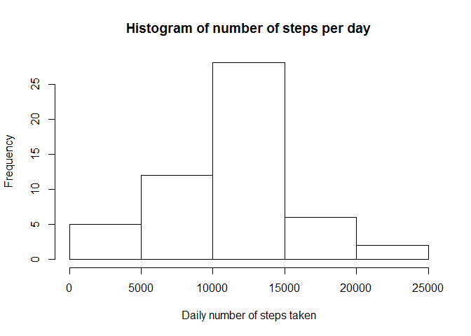
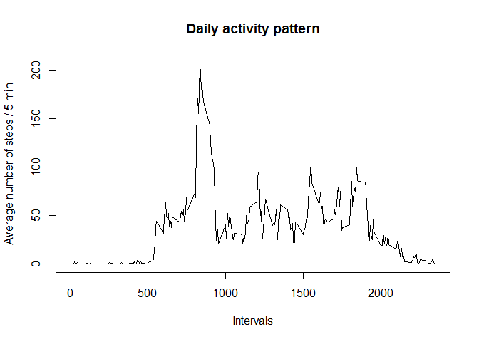
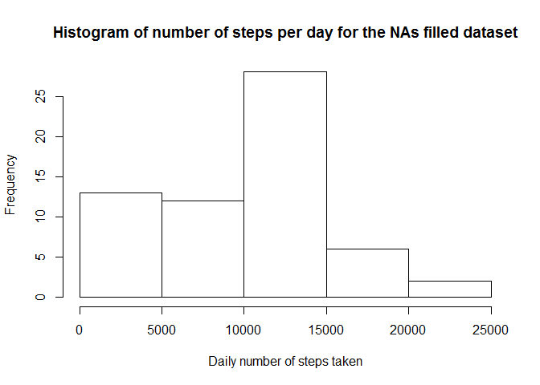
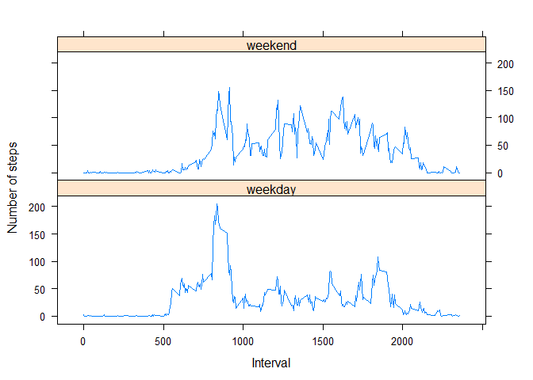

# Reproducible Research: Peer Assessment 1
Thierry Daubos  
July 9, 2015  

### Settings of the Rmd document
Let's first define the global settings for this markdown document


```r
library(knitr)
opts_chunk$set(echo = TRUE, results="show")
```

### Loading and preprocessing the data

1. We start by unzipping the dataset file (assuming it's stored in the working directory),  
and we read the csv file, using "," as separator and keeping the header for column names.


```r
unzip("./activity.zip","activity.csv", overwrite = TRUE)
activity <- read.csv("./activity.csv", sep = ",", header = TRUE, na.strings = "NA")
head(activity)
```

```
##   steps       date interval
## 1    NA 2012-10-01        0
## 2    NA 2012-10-01        5
## 3    NA 2012-10-01       10
## 4    NA 2012-10-01       15
## 5    NA 2012-10-01       20
## 6    NA 2012-10-01       25
```

2. The date column, which is currently a *factor* is recast as a *date*:

```r
activity$date <- as.Date(activity$date, "%Y-%m-%d")
class(activity$date)
```

```
## [1] "Date"
```

### What is mean total number of steps taken per day?

1. We create the histogram of the total number of steps taken each day (NA's values ignored)

 The dataset is molten into a "long format" using the reshape library.  
 The total number of steps per day is computed using the dcast function

```r
library(reshape2)

melt_activity   <- melt(activity, id = c("date", "interval"), measure.vars = "steps", na.rm = FALSE)
steps_per_day   <- dcast(melt_activity, date ~ variable, sum)
hist(steps_per_day$steps,
     main = paste("Histogram of number of steps per day"),
     xlab = "Daily number of steps taken"
)
```

 

2. Calculate and report the mean and median total number of steps taken per day


```r
mean(steps_per_day$steps  , na.rm = TRUE)
```

```
## [1] 10766.19
```

```r
median(steps_per_day$steps, na.rm = TRUE)
```

```
## [1] 10765
```

### What is the average daily activity pattern?

1. Make a time series plot of the 5-minute interval (x-axis) and the average number of steps taken, averaged across all days (y-axis)


```r
activity_pattern  <- dcast(melt_activity, interval ~ variable, mean, na.rm = TRUE)
plot(activity_pattern$interval, activity_pattern$steps, 
     type="l",
     main = paste("Daily activity pattern"),
     xlab = "Intervals",
     ylab = "Average number of steps / 5 min"
     )
```

 

2. Which 5-minute interval, on average across all the days in the dataset, contains the maximum number of steps?


```r
activity_pattern$interval[which.max(activity_pattern$steps)]
```

```
## [1] 835
```


### Imputing missing values

1. We calculate the total number of missing values in the molten dataset  
   (i.e. the total number of rows with NAs)


```r
sum(is.na(melt_activity$value))
```

```
## [1] 2304
```

2. Devise a strategy for filling in all of the missing values in the dataset. 

The NA values in the molten dataset are going to be filled in with the median number of steps for the corresponding interval.  
We use the *impute()* function from the *Hmisc* package do to this.   


```r
library(Hmisc)
```

```
## Loading required package: grid
## Loading required package: lattice
## Loading required package: survival
## Loading required package: Formula
## Loading required package: ggplot2
## 
## Attaching package: 'Hmisc'
## 
## The following objects are masked from 'package:base':
## 
##     format.pval, round.POSIXt, trunc.POSIXt, units
```

```r
var.interval <- unique(melt_activity$interval)

imputeMedian <- function(impute.var, filter.var, var.levels) {
      for (v in var.levels) {
            tmp             <- which(filter.var == v)
            impute.var[tmp] <- impute(impute.var[tmp], median)
      }
      return (impute.var)
}

melt_activity$value <- imputeMedian(melt_activity$value, melt_activity$interval, var.interval)
```

3. Create a new dataset that is equal to the original dataset but with the missing data filled in.


```r
activity_filled <- dcast(data = melt_activity, 
                   formula = date + interval ~ variable,
                   fun.aggregate = sum,
                   value.var = "value")
activity_filled <- activity_filled[c("steps", "date", "interval")]
str(activity_filled)
```

```
## 'data.frame':	17568 obs. of  3 variables:
##  $ steps   : int  0 0 0 0 0 0 0 0 0 0 ...
##  $ date    : Date, format: "2012-10-01" "2012-10-01" ...
##  $ interval: int  0 5 10 15 20 25 30 35 40 45 ...
```

4.1 Make a histogram of the total number of steps taken each day and Calculate and report the mean and median total number of steps taken per day.

```r
activity_per_day            <- as.data.frame(split(activity_filled$steps, activity_filled$date))
colnames(activity_per_day)  <- unique(activity_filled$date)
steps_per_day_filled        <- sapply(activity_per_day, sum)
hist(steps_per_day_filled,
     main = paste("Histogram of number of steps per day for the NAs filled dataset"),
     xlab = "Daily number of steps taken"
    )
```

 


4.2 Do these values differ from the estimates from the first part of the assignment? 

```r
print(c("Mean number of steps / day for the original dataset : ", mean(steps_per_day$steps, na.rm = TRUE)))
```

```
## [1] "Mean number of steps / day for the original dataset : "
## [2] "10766.1886792453"
```

```r
print(c("Mean number of steps / day for the NAs filled dataset   : ", mean(steps_per_day_filled)))
```

```
## [1] "Mean number of steps / day for the NAs filled dataset   : "
## [2] "9503.86885245902"
```

```r
print(c("Median number of steps / day for the original dataset : ", median(steps_per_day$steps, na.rm = TRUE)))
```

```
## [1] "Median number of steps / day for the original dataset : "
## [2] "10765"
```

```r
print(c("Median number of steps / day for the NAs filled dataset   : ", median(steps_per_day_filled)))
```

```
## [1] "Median number of steps / day for the NAs filled dataset   : "
## [2] "10395"
```


4.3 What is the impact of imputing missing data on the estimates of the total daily number of steps?

As seens above, imputing missing data based on the median number of steps for each interval leads to a decrease in both the mean and median number of steps taken daily. This is reflected by the rise of frequency for the first bin of the histogram.

### Are there differences in activity patterns between weekdays and weekends?

1. Create a new factor variable in the dataset with two levels – “weekday” and “weekend” indicating whether a given date is a weekday or weekend day.

We start by setting the system local names for weekdays to the USA standard.  
We use the *weekdays()* function to assign to each date the corresponding day of the week.  
Then we use the *revalue()* function from *plyr* package to create the two level factor "weekday", "weekend"  


```r
Sys.setlocale("LC_TIME", "USA")
```

```
## [1] "English_United States.1252"
```

```r
library(plyr)
```

```
## 
## Attaching package: 'plyr'
## 
## The following objects are masked from 'package:Hmisc':
## 
##     is.discrete, summarize
```

```r
activity_filled$weekdays <- as.factor(revalue(weekdays(activity_filled$date),
                                              c("Monday"   = "weekday", 
                                                "Tuesday"  = "weekday", 
                                                "Wednesday"= "weekday", 
                                                "Thursday" = "weekday", 
                                                "Friday"   = "weekday", 
                                                "Saturday" = "weekend",
                                                "Sunday"   = "weekend"
                                                )
                                              )
                                      )
```


2. Make a panel plot containing a time series plot (i.e. type = "l") of the 5-minute interval (x-axis) and the average number of steps taken, averaged across all weekday days or weekend days (y-axis).

We melt the filled activity dataset, including the "weekdays" factor.  
Then we compute the number of steps per interval, average over all days.  
Finally, we plot the two panels for "weekday" and "weekend" using *xyplot()* function from the *lattice* library.  


```r
library(lattice)

melt_activity_filled    <- melt(activity_filled, id = c("date", "interval", "weekdays"), measure.vars = "steps", na.rm = FALSE)
activity_pattern_filled <- dcast(melt_activity_filled, interval + weekdays ~ variable, mean, na.rm = TRUE)

xyplot(activity_pattern_filled$steps ~ activity_pattern_filled$interval | activity_pattern_filled$weekdays, 
       layout = c(1,2),
       xlab = "Interval",
       ylab = "Number of steps",
       type = "l")
```

 

